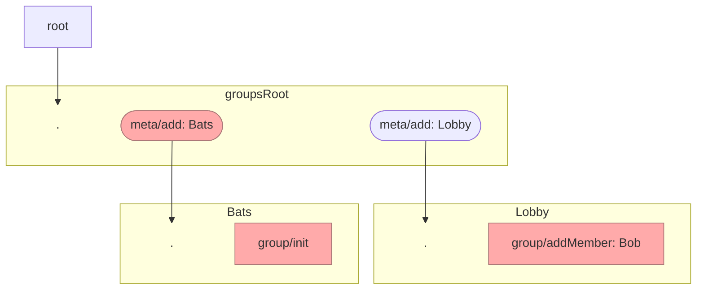

Source: https://hackmd.io/KNQenk_IRZSrphXuj_6GNA?edit

---

# Bat butts 2022-06-{02|03} - group meta feeds jam

Prior art: https://hackmd.io/3g17VjtwRx6OkU0nGqku1w?view

ask later:

groups only, is private chats extended different?

---

## Scenario 1

Actors:
- Alice - starts a group
- Bob - is invited to the group by Alice

### Alice:

#### Create group
1. `metafeed/add/derived` on root: groupRoot
   - groupRoot is the feed for all group coordination messages
2. `metafeed/add/derived` on groupRoot: Lobby
   - "lobby" is the feed for all group invitations and applications
3. `metafeed/add/derived` on groupRoot: Batts
   - encrypted to.... groupKey (:question:)
4. `group/init`

#### Invite Bob
2. `group/addMember` encrypted to group and Bob message on lobby feed?

### Bob:

#### Discovers he has been invited

1. Bob is replicating Alice, so gets:
    - her root feed, which announces a groupsRoot
    - replicates her groupsRoot, which announces a "Lobby"
    - replicates her "Lobby" and discovers a `group/addMember` message for him
2. read the `group/addMember`, loads the groupKey, and re-indexes the groupsRoot messages from Alice...
    - NOTE if alice invited but did not start the group... then we have to re-index ALL groupsRoot messages
    - decrypts alice's `meta/add: Bats` message
3. Bob now replicates Alices' Bats feed
4. Bob sets up his own Bats feed (encrypted meta/add)

### Alice:

1. Alice is replicating Bob, and sees he has a `meta/add: Bats` announce
2. she starts replicating Bobs Bats feed

_fin_

## Scenario 2 (extends 1)

same as (1), except after inviting Bob, Alice invites Cherese

### Alice invites Cherese
1. `group/addMember` encrypted to group and Cherese message on lobby feed

### Cherese discovers she has been invited

1. Cherese is replicating Alice, so gets:
    - her root feed, which announces a groupsRoot
    - replicates her groupsRoot, which announces a "Lobby"
    - replicates her "Lobby" and discovers a `group/addMember` message for her
2. read the `group/addMember`, loads the groupKey, and re-indexes the groupsRoot messages from Alice...
    - decrypts alice's `meta/add: Bats` message
3. Cherese now replicates Alices' Bats feed
4. Cherese sets up her own Bats feed (encrypted meta/add) from Alice
5. Cherese re-indexes Alices Lobby feed, and discovers Bob was invited **<<< only difference**
    - she then replicates Bob (root, groupsRoot, lobby, bats)

## Scenario 3 (extends 1)

same as (1), except after Bob joins, he invites Cherese (non group-creator invites)

### Bob invites Cherese
1. `group/addMember` encrypted to group and Cherese message on lobby feed

### Cherese discovers she has been invited

1. Cherese is replicating Bob, so gets:
    - his root feed, which announces a groupsRoot
    - replicates his groupsRoot, which announces a "Lobby"
    - replicates his "Lobby" and discovers a `group/addMember` message for her
2. read the `group/addMember`, loads the groupKey, and re-indexes the groupsRoot messages from Bob...
    - decrypts bob's `meta/add: Bats` message
3. Cherese now replicates Bob's Bat feed
4. Cherese sets up her own Bats feed (encrypted meta/add) from Alice

Problem:
- cherese does not know that Alice is in the group

Possible solution:
- when Bob is accepting he may need to point to his inviter...
- Bob inviting Cherese could encrypt `group/AddMember` to `[groupId, Alice, Cherese]`
   - mix: :heart: _very elegant_
- **if Alice is already in FOAF range**, then Cherese could discover she is in the same group by re-indexing all her contacts groupRoot feeds....
- In Ahau, we only (currently) have "apply to join", and this is a form set up by Alice. i.e. to apply to join a group you already have the group initiator, which means we're never in this scenario.

Another possible solution:

- Bob could have a sub-subfeed dedicated to "people who I think are in this group" => [Alice, Bob, Cherese]
- Alice would have a sub-subfeed dedicated to "people who I think are in this group" => [Alice, Bob]
- Cherese would have a sub-subfeed dedicated to "people who I think are in this group" => [Bob, Cherese]
- **PROS**
- **CONS**
  - A group with 100 members would require you to replicate 100^2 messages
    - ~~Counterargument: we could replicate them in memory~~

## Designing for versioning

- root size 4
  - main
  - groupsRoot
    - v1
      - lobby
      - battsRoot
  - indexes
    - v1
      - indexPost
      - indexVote
      - indexAbout
      - indexContact
  - apps size N
    - twitter size 4
      - post
        - v1
      - vote
        - v1
    - games
      - chess
        - v1
    - fart
    - gathering

- root
  - main

## LEARNING/ QUESTIONS

1. we think we have a decent architecture
2. replication schedular is gonna get a workout
3. we must add "implicit replication" with groups
    - have to replicate everyone in the group
    - knowledge of this replication is "private" - i.e. different to public follows
4. unsolved
    - Scenario 3 needs a solution (new member invites a new member)
    - teach replication scheduler about this groups pattern
    - consent after receiving `group/addMember`
        - we want to add this so that we can send people invite+key (fast) but not fall into the abuse path of people getting randomly added to "NaziPedophile" group
        - consent could be.... you announce your Bats subfeed
        - tie in with replication scheduler

## Questions by stolfs

- **What about versioning?** (oops we made a mistake in the design of these subfeeds, so here's v2 that you should replicate instead of v1)
  - There is a tradeoff between "too many feeds to ask during EBT" and "too many messages to replicate" => DESIGN CAREFULLY
  - What is the worst case scenario for the size of a metafeed? What if someone joins 1000 groups or invites 1000 people?
- What about subgroups?
  - mix: there are actually no "subgroups" in the encryption
- What if we "sympathetic replication"
  - mix: we could have an encrypted "content" in a message but also a public "content2" which tells what the subfeed id is so that anyone can replicate it
  - mix: OR we could have a subfeed dedicated to announcing the feedIds that other people could help me replicate

## Action points

- Look into prior art for "designing subfeeds"
- Discuss "v1" and domain splitting with arj

