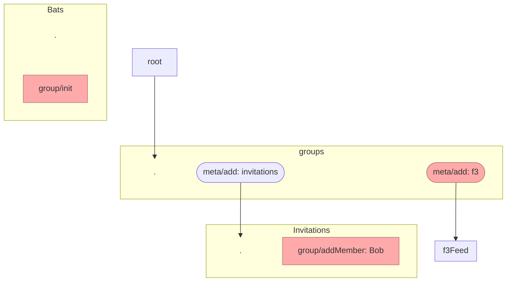

Source: https://hackmd.io/OfNvS1E4Q5O0BSZwhYLZOw

---

# Private Groups vs Meta Feeds  | 2022-07-06

Prior art:
- https://hackmd.io/KNQenk_IRZSrphXuj_6GNA?view

## Metafeeds structure

See also https://github.com/ssbc/ssb-meta-feeds-spec/issues/30

Can we separate "membership" from "groups", such that we could have public groups (i.e. membership mechanics without the box2 encryption)

TODO: FIX THIS DIAGRAM GIVEN THE PAPER NOTES



## Network identity

https://github.com/ssbc/ssb-network-identity-spec

## What's in ssb-tribes


----


## ssb-keyring

startup:
- load db
- load in all your DM keys
    - each subfeed has a keypair and could be DM'd

```js 

// ssb-box2

const ring = await keyRing(path)

// assume persisting dm keys

const keysToTry = ring.decryption(authorId)
  groupKeys that authorId is know to be in
  DMKeys:
    DH(authorPk x rootSk)
    DH(authorPk x mainSk) (optional)
      - this may be needed if main feed is presen
   

```


**Questions:**
1. who DM's who?
    - author: @mixInvitationFeedId
    - recps: [@andersFeedId]
        - which anders feedId?
        - which anders DM key?
    - PROPOSAL A
      - root metafeed is the recp
    - PROPOSAL B
      - only DM "parallel/sister" sub-feeds
      - ehhhh... not sure
    - PROPOSAL C
      - main feed is the recp
      - pros: good for compat, BUT, we don't need compat with Patchwork etc regarding box2 and metafeeds
    
**Principles:**
- low level foot-guns, high level good ideas
- complexity lens - you have to write the code
- make it work, make it right, make it fast; in that order

## Agreements

1. (for now) when DM'ing a person:
   a) use the root feedId
   b) the DH key derived from root feedId
2. (for now) drop membership from ssb-keyring
    - anders is gonna benchmark
      - check for 10 / 100 / 1000 groups
      - check "known membership" versus "try all"

