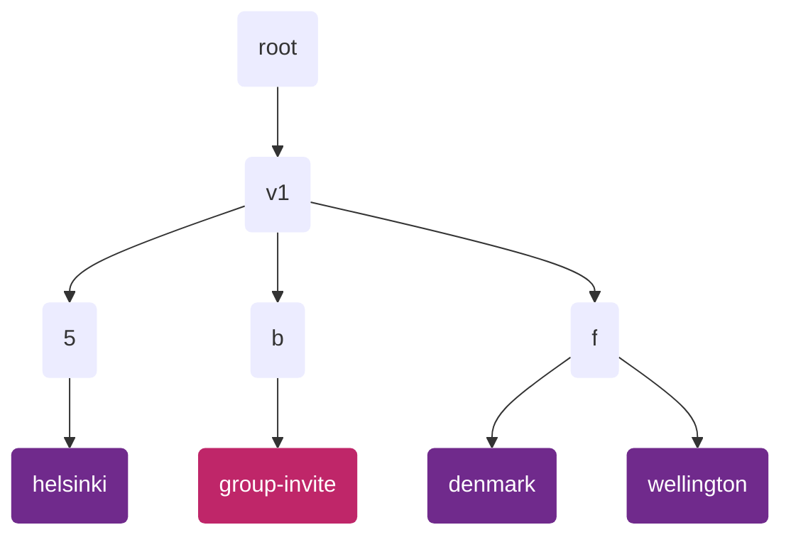
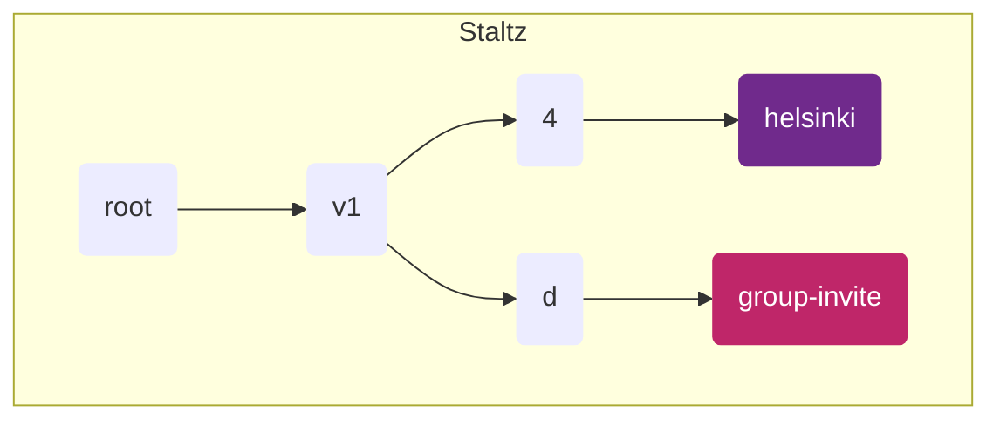
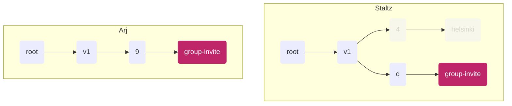
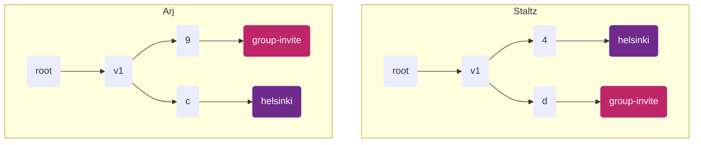

# ssb-meta-feed-group-spec
_working title_

## Problem

We want to put different group content in different sub-feeds, in order to support more partial replication.

But we need have a clear way to discover how you've been invited to a group without replicating the whole group's data.

We also need to consider how to ensure our group data is replicated _enough_ - e.g. if a group is just me and my sister, then are there gonna be enough copies of the group data to be resilent/ timely.


## Principles

1. **group membership should be opaque**
   - you shouldn't be able to guess who is in a group using public info
     - shards people are using
     - groupId (e.g. %a2148bs2K3klmhnaALsdaN90=.cloaked)
2. **we support sympathetic replication**


## Spec

This work builds on the [ssb-meta-feeds-spec] (v1).

We define two types of feeds that each peer will have:
1. <div class='group-invite'></div> the group-invite feed
2. <div class='group'></div>        group feeds



_Diagram showing an example layout of group-related feeds. Note that the shards in your
use-case will likely not be those shown, see how they are determined below._


### the group-invite feed

This feed holds messages which help peers join groups (e.g. `group/registration`, `group/add-member` messages).
This feed MUST be unique for each peer (a singleton).
Each peer MUST replicate this feed from each of their peers (OR each peer they might possibly enter a group with).

For each peer, this feed MUST be located on the meta-feed tree at:
```
/v1/:shard/group-invite
```
Where:
- `:shard` is the shard feed derived using the string `"group-invite"`
- `group-invite` is a content feed with
    - `feedpurpose = "group-invite"`
    - `feedtype = ?` :warning:

See [ssb-meta-feeds-spec] for detail about the `v1` shared and the `shard` calculation.

All content on this feed SHOULD be encrypted with box2 encryption.


### group feeds

Group feeds MUST be located on the meta-feed tree at:

```
/v1/:shard/:groupKey
```
Where:
- `:shard` is the shard feed derived using BFE encoded `groupKey`
    <details>
      <summary>details</summary>
      <div>
        We cannot use the `groupId`, as this is publicly known, which would give attackers a way to test if people are in the group (breaking Principle 1.)
        <br />
        We choose the the `groupKey` because it is a value known only to those already in the group.
      </div>
    </details>
- `:groupKey` is a content feed where
    - `feedpurpose = groupKey` where `groupKey` is the ssb-uri encoded groupKey for the group
    - `feedtype = ?` :warning:
    - the announcement of the this sub-feed MUST be encrypted with this group's `groupKey`
      <details>
        <summary>details</summary>
        <div>
          We need a `feedpurpose` which is unique to the group, which the `groupKey` is.
          We cannot use the `groupId`, because this is derived using the group init message, which does not exist until our feed exists.
          We encrypt this announce message so as not to leak the groupKey AND to protect group membership.
          <br />
          For sympathetic replication we will therefor need a distinct type of announce message (TODO)
        </div>
      </details>


## Flows

### 1. Creating a group

Staltz starts up his application.
We assume he has already created his `group-invite` feed (following the spec above).
In his application he creates a new "helsinki" group, which means he:
1. creates a new symmetric `groupKey`
2. create a content feed under a new shard (using the `groupKey` following the spec above)
3. publishes an encrypted `group/init` message to that new "helsinki" feed
4. publishes an encrypted `group/add-member` message to his "group-invite" feed
      <details>
        <summary>details</summary>
        <div>
          This helps new members quickly see he is a member of the group, and also ensures he has a copy of the groupKey persisted in his records (encrypted to him and the group)
        </div>
      </details>


_Diagram showing Staltz feed state from his perspective_

### 2. Group creator invites someone

Staltz wants to invite his friend Arj to the group he set up, so he publishes a `group/add-member` message (which conatins the `groupKey`) to his "group-invite" feed.

When Arj next stats up his application and replicates Staltz's feed (they are friends) he discovers the new `group/add-member` for him Staltz's "group-invite" feed (peers MUST replicate friends group-invite feeds).


_Diagram showing feed state of Arj and Staltz from Arj's perspective. The greyed out feeds show feeds that exist for Staltz but which Arj has yet to want to replicate_


Assuming he accepts this invitation Arj then does the following:
1. calculates the path to the "helsinki" group for staltz, and starts replicating it
    - in this example `@statlz/v1/4/helsinki` (where "helsinki" is derived from the `groupKey`)
2. creates a helsinki feed for themself




_Diagram showing updated state for Arj after he joins the group. Note the shards each feed lands in are random (but deterministic if you know the `groupKey`)_

Staltz can see that Arj has accepted the invitation because he is able to decrypt the feed-announce message for Arj's "helsinki" feed, and read that the purpose is the `groupKey`.
(He also knows where to watch for such a feed to be announced because the shared is deterministiclly chosen.)

### 3. Non-group creator invites someone

Arj now wants to invite Mix to the "helsinki" group. He follows the same pattern as in (2), but now as the inviter.

Mix knows Arj is a part of the group because he was invited by them.
Mix also knows staltz is part of the group because all `group/add-member` messages have
```
recps: [groupId, groupCreatorId, ...inviteeIds]
```
_As long as we know the creator we can always re-follow the chain of group-additions._

:fire: TODO - we need to write the group spec up with these changes clearly somewhere.

Staltz see Arj has invited Mix because he's replicating Arj's "group-invite" feed, so Statlz starts replicating Mix.


## Questions

1. if people in a group see that "mix was added" they are all going to start asking to replicate the feed "pathToMixsGroupFeed". On a network level this will cast a shadow revealing group members....
    - possible soluton: raise sympathetic replication for obfuscation
2. same problem as (1) exists when people join a group - they're going to start all asking for the same pattern of feeds (e.g. "can I have staltz/v1/d4/helsinki and arj/v1/c/helsinki"). It's like a fingerprint...

---

Existing work to be ported in:
1. [2022-06-02 meeting](./2022-06-02-notes.md) - has good steps for how discovery works
2. [2022-07-06 meeting](./2022-07-06-notes.md)


<!-- References -->
[ssb-meta-feeds-spec]: https://github.com/ssbc/ssb-meta-feeds-spec


<!-- CSS -->
<style>
  .group-invite, .group {
    display: inline-block;
    width: 14px;
    height: 14px;
    border-radius: 2px;
  }
  .group-invite { background: #BF2669; }
  .group { background: #702A8C; }

  details > summary {
    color: grey;
    font-size: 12px
  }
  details > div {
    font-style: italic;
    background: #eee;

    padding: 14px 10px;
    border-left: 3px solid #999;
    margin-left: 10px;
  }
</style>
