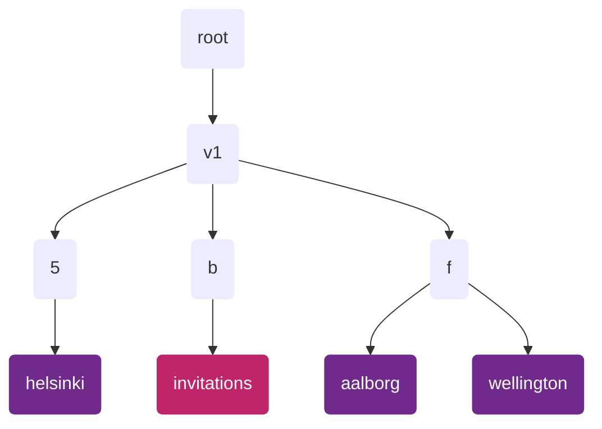
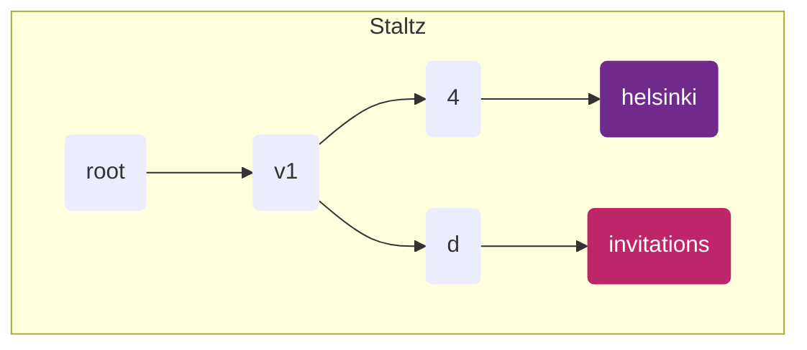
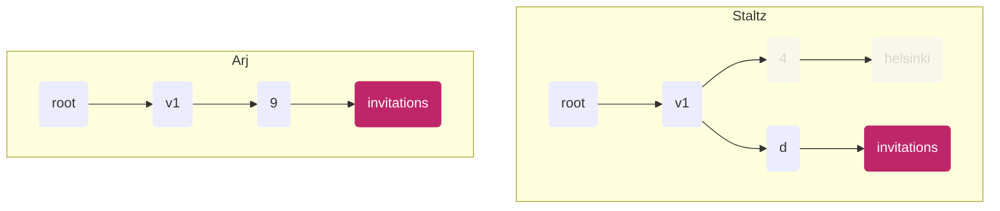
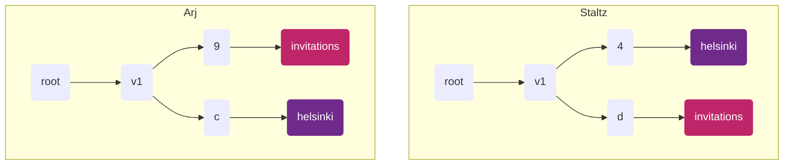

<!--
SPDX-FileCopyrightText: 2022 Mix Irving

SPDX-License-Identifier: CC-BY-4.0
-->

# ssb-meta-feed-group-spec

Version: 1.0

Author: Mix Irving <whimful@gmail.com>

License: This work is licensed under a Creative Commons Attribution 4.0 International License.

## Abstract

With the introduction of groups, there will be a lot more content that is not publicly accessible.
This could cause onboarding and storage problems.

## Solution: Groups in sub-feeds

If we put each group's content in a different sub-feed, then peers can fetch only the sub-feeds
which are relevant to them. i.e. If you're not part of a group, you can choose not to replicate it!
(Metafeeds is one way we can support "partial replication".)

## New Problems

Hosting groups on their own sub-feeds introduces new problems:
- how do I know if I've been invited to a group (which feed are invites in)
- once I'm invited to a group, how do I know which sub-feed to publish to?
- if peers only replicate groups they're in, will there be enough _gossip_ to sustain discourse?
  - e.g. in the extreme case where a group is just me and a friend using only ssb-room tunnels, updates will only propogate if both my and my friend are online at the same time ):
  - _see : "sympathetic replication"_

This document specifies how group content is organized in a metafeed tree, what
data must be encrypted and to whom, and how peers replicate group-related 
portions of the tree.

## Terminology

The key words "MUST", "MUST NOT", "REQUIRED", "SHALL", "SHALL NOT", "SHOULD", 
"SHOULD NOT", "RECOMMENDED", "MAY", and "OPTIONAL" in this document are to be 
interpreted as described in [RFC 2119](https://tools.ietf.org/html/rfc2119).

## Principles

1. **Group membership should be opaque**
  - You shouldn't be able to guess who is in a group using public info, such as:
    - shard feeds
    - `groupId` (as ssb-uri)
2. **Peers should replicate sympathetically**
   - If a friend has a subfeed dedicated to a group, but I don't belong to that group, it is RECOMMENDED that I replicate that subfeed
   - May be randomized or subject to sympathy-related parameters


## Specification

This work builds on the [ssb-meta-feeds-spec] (v1).

We define two types of feeds that each peer will have:
1. An `invitations` feed
2. A "group feed" for each group


_Diagram showing an example layout of group-related feeds. Note that the shards in your
use-case will likely not be those shown, see how they are determined below._


### 1. The invitations feed

The purpose of this feed is to hold messages for coordination of joining groups.

- 1.1 Each peer running this spec MUST have an invitations feed
- 1.2 Each peer MUST deterministically place their invitations feed as a subfeed, such that:
  - their invitations feed is a direct subfeed of a shard feed
  - the shard feed is a subfeed of the v1 subfeed, and derived from the string `"invitations"` according to the v1 tree structure specified in [ssb-meta-feeds-spec].
  - the `metafeeds/add/derived` message announcing the invitations feed
      - MUST have `feedpurpose` equal to `"invitations"`,
      - MUST be of feed format `classic`
      - MUST have `metadata` equal to `{ directMessage: publicKey }` where
          - `publicKey` is the base64 encoded public part of a curve25519 Diffie-Hellman keypair
      - MUST NOT be encrypted
- 1.3 You MUST replicate each other peers invitations feed
- 1.4 All content on the invitations feed SHOULD be encrypted with [box2] encryption, also known as "envelope spec".
  - see details below
- 1.5 The invitations feed must be a singleton and MUST NOT be tombstoned
  - this feed represents the record of all people joining each group and must not be lost

#### `group/add-member` messages

This is the only type of message currently expected in the invitations feed.
It's defined in the [private-group-spec] to look like this:

```js
{
  type: 'group/add-member',
  version: 'v2',

  root: 'ssb:message/classic/THxjTGPuXvvxnbnAV7xVuVXdhDcmoNtDDN0j3UTxcd8=',
  secret: '3YUat1ylIUVGaCjotAvof09DhyFxE8iGbF6QxLlCWWc=',

  recps: [
    'ssb:identity/group/vof09Dhy3YUat1ylIUVGaCjotAFxE8iGbF6QxLlCWWc=',    // group_id
    'ssb:feed/bendybutt-v1/YXkE3TikkY4GFMX3lzXUllRkNTbj5E-604AkaO1xbz8=', // feed_id
  ],

  tangles: {
    group: {
      // ...
    },
    members: {
      // ...
    }
  }
}
```

The important parts of this message are:
- which group this is for (this is covered by the `root` and `secret`)
- who it's encrypted to (the group, and the feed(s) of people being added)

The encryption of this message MUST follow the the [ssb-meta-dm-spec].

### 2. Group feeds

The purpose of this feed is to hold the groups messages.

- 1.1 Each peer that is a member of a group MUST have a group feed for that group
- 1.2 Each peer MUST deterministically place their group feed as a subfeed, such that:
  - their group feed is a direct subfeed of a shard feed
  - the shard feed is a subfeed of the v1 subfeed, and derived from the base64 encoded string of the group secret key `secret` according to the v1 tree structure specified in [ssb-meta-feeds-spec].
  - the `metafeeds/add/derived` message announcing the group feed
      - MUST have `feedpurpose` equal to the base64 encoded group secret
      - MUST be encrypted with the group secret, using [box2] encryption
- 1.3 You MUST replicate the each other peers group feed
- 1.4 All content on the group feed MUST be encrypted with the group secret key, using [box2] encryption, also known as "envelope spec".


<details>
  <summary>Details about the shard feed</summary>
  <div>
The shard feed is derived by the base64 encoded group secret.

We cannot use the group `id`, as this is publicly known, which would give attackers a way to test if people are in the group (breaking Principle 1.)

We choose the the group `secret` because it is a value known only to those already in the group.
  </div>
</details>
    
<details>
  <summary>Details about the group feed</summary>
  <div>

* `feedpurpose = secret` where `secret` is the base64 encoded group secret
* `feedFormat = classic`
* The `metafeed/add/derived` message on the shard feed MUST be encrypted with this group's secret

We need a `feedpurpose` which is unique to the group, which the group secret is.

We cannot use the group `id`, because this is derived using the group init message, which does not exist until our feed exists.
We encrypt this announce message so as not to leak the `secret` AND to protect group membership.

For sympathetic replication we will therefore need a distinct type of announce message (TODO)
  </div>
</details>


## Flows

### 1. Creating a group

Staltz starts up his application.
We assume he has already created his `invitations` feed (following the spec above).
In his application he creates a new "helsinki" group, which means he:
1. Creates a new symmetric `groupKey`, also known as "group secret"
2. Creates a content feed under some shard (using the `groupKey` following the spec above)
3. Publishes a box2-encrypted `group/init` message on that new "helsinki" content feed
4. Publishes a box2-encrypted `group/add-member` message on his "invitations" feed
      <details>
        <summary>details</summary>
        <div>
          This helps new members quickly see he is a member of the group, and also ensures he has a copy of the groupKey persisted in his records (encrypted to him and the group)
        </div>
      </details>


_Diagram showing Staltz feed state from his perspective_

### 2. Group creator invites someone

Staltz wants to invite his friend Arj to the group he set up, so he publishes a `group/add-member` message
(which contains the group `secret`) on his "invitations" feed.

When Arj next starts up his application and replicates Staltz's feed tree (they are friends), he discovers
the new `group/add-member` for him on Staltz's "invitations" feed (because peers must replicate their friends'
"invitations" feeds).


_Diagram showing feed state of Arj and Staltz from Arj's perspective. The greyed out feeds show feeds that exist
for Staltz but which Arj has yet to want to replicate._


Assuming he accepts this invitation, Arj then does the following:
1. Calculates the shard for the "helsinki" group for staltz, and starts replicating that shard feed and the "helsinki" feed
2. Creates a "helsinki" feed for himself




 _Diagram showing the updated state for Arj after he joins the group. Note the shards each feed lands in are
 different for each person (but deterministic if you know the `groupKey`)._

Staltz can see that Arj has accepted the invitation because he is able to decrypt the feed announcement 
message for Arj's "helsinki" feed on the shard feed, and read that the `feedpurpose` is the `groupKey`.
Staltz knows which shard feed to watch for the announcement, because Arj's shard feed is deterministically
derived with information Staltz is aware of.

### 3. Non-group creator invites someone

Arj now wants to invite Mix to the "helsinki" group. He follows the same pattern as in (2), but now as the inviter.

Mix knows Arj is a part of the group because he was invited by them.
Mix also knows Staltz is part of the group because all `group/add-member` messages have

Staltz can see Arj has invited Mix because he's replicating Arj's "invitations" feed, so Staltz starts replicating Mix's group feed.


<!-- References -->
[ssb-meta-feeds-spec]: https://github.com/ssbc/ssb-meta-feeds-spec
[private-group-spec]: https://github.com/ssbc/private-group-spec
[ssb-meta-dm-spec]: https://github.com/ssbc/ssb-meta-dm-spec
[box2]: https://github.com/ssbc/envelope-spec/
