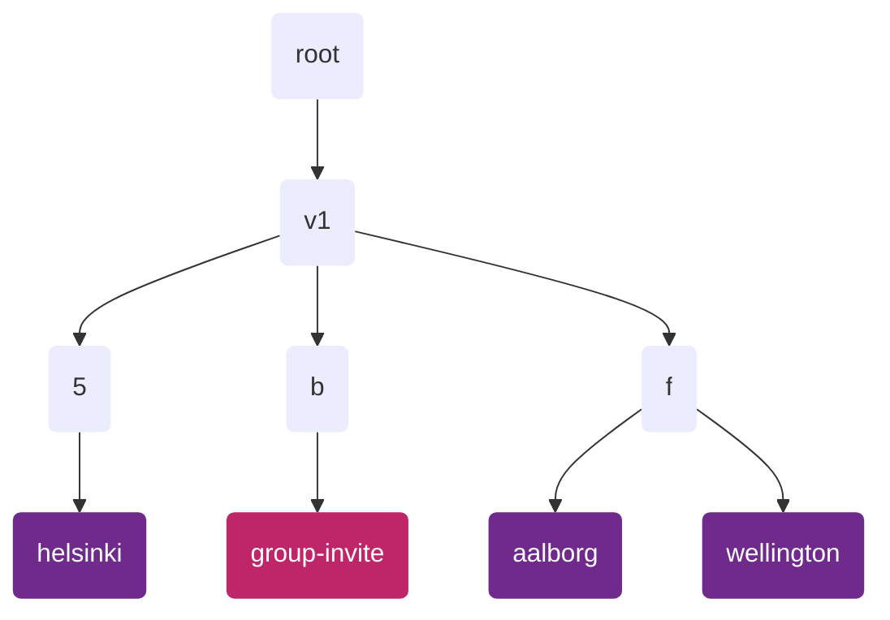
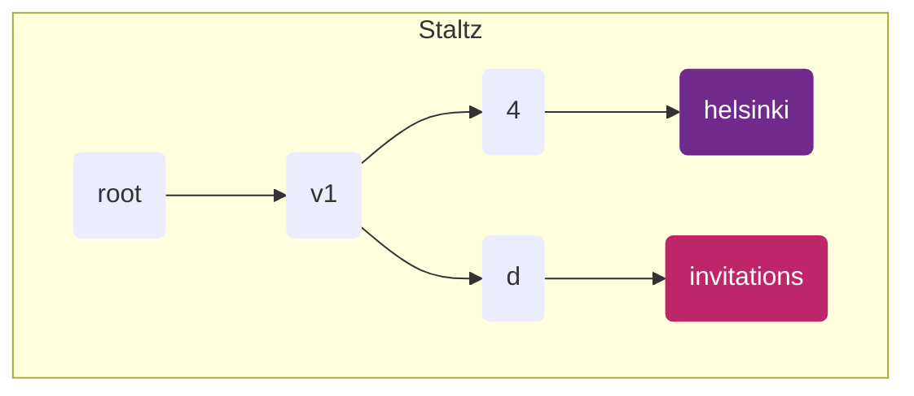
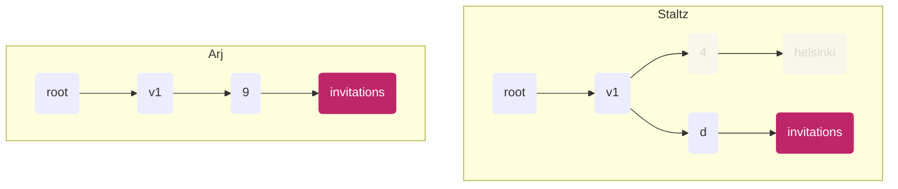
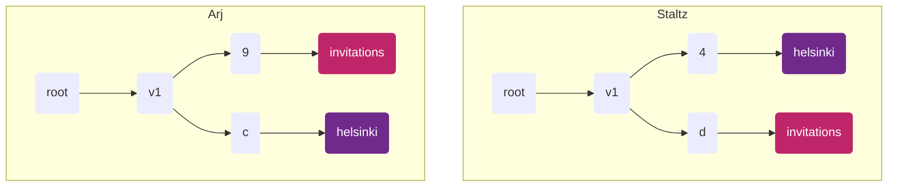

# ssb-meta-feed-group-spec
_working title_

## Problem

We want to put different group content in different sub-feeds, in order to support more partial replication.

But we need have a clear way to discover how you've been invited to a group without replicating the whole group's data.

We also need to consider how to ensure our group data is replicated _enough_. For example, if a group is just me and
my sister, then are there gonna be enough copies of the group data? If there are too few copies of the data, there's
little or no gossip propagation, and can only get updates from my sister when we are directly connected.


## Principles

1. **Group membership should be opaque**
   - You shouldn't be able to guess who is in a group using public info, such as:
     - Shard feeds
     - `groupId` as a "cloaked message ID"
2. **Peers should replicate sympathetically**
  - If a friend has a subfeed dedicated to a group, but I don't belong to that group, it is RECOMMENDED that I replicate that subfeed
  - May be randomized or subject to sympathy-related parameters


## Spec

This work builds on the [ssb-meta-feeds-spec] (v1).

We define two types of feeds that each peer will have:
1. <div class='group-invite'></div> the group-invite feed
2. <div class='group'></div>        group feeds



_Diagram showing an example layout of group-related feeds. Note that the shards in your
use-case will likely not be those shown, see how they are determined below._


### The invitations feed

This feed holds messages which help peers join groups (e.g. `group/add-member`, `group/registration` messages).
This feed MUST be unique for each peer (a singleton).
Each peer A who replicates the root metafeed of another B SHOULD also replicate B's invitation feed. 

The invitations feed MUST be a direct subfeed of a shard feed, where the shard is derived using the string `"invitations"`.
The `metafeeds/announce/add` message announcing the invitations feed MUST have `feedpurpose` equal to `"invitations"`,
and MUST NOT be encrypted.

```
/v1/:shard/invitations
```
Where:
- `:shard` is the shard feed derived using the string `"invitations"`
- `:invitations` is a content feed with
    - `feedpurpose = "invitations"`
    - `feedFormat = classic`

See [ssb-meta-feeds-spec] for detail about the `v1` shared and the `shard` calculation.

All content on this feed SHOULD be encrypted with box2 encryption.


### Group feeds

Each group feed MUST be a direct subfeed of a shard feed, where the shard is derived using the base64 encoded group `secret`.
A group feed MUST be declared on the shard feed with `feedpurpose` equal to the same base64 encoded group `secret`.
This message MUST be encrypted (with the group secret).

```
/v1/:shard/:group
```
Where:
- `:shard` is the shard feed derived using the base64 encoded group `secret`
    <details>
      <summary>details</summary>
      <div>
        We cannot use the group `id`, as this is publicly known, which would give attackers a way to test if people are in the group (breaking Principle 1.)
        <br />
        We choose the the group `secret` because it is a value known only to those already in the group.
      </div>
    </details>
- `:group` is a content feed where
    - `feedpurpose = secret` where `secret` is the base64 encoded group secret
    - `feedFormat = classic`
    - the announcement of the this sub-feed MUST be encrypted with this group's `secret`
      <details>
        <summary>details</summary>
        <div>
          We need a `feedpurpose` which is unique to the group, which the group `secret` is.
          We cannot use the group `id`, because this is derived using the group init message, which does not exist until our feed exists.
          We encrypt this announce message so as not to leak the `secret` AND to protect group membership.
          <br />
          For sympathetic replication we will therefore need a distinct type of announce message (TODO)
        </div>
      </details>


## Flows

### 1. Creating a group

Staltz starts up his application.
We assume he has already created his `invitations` feed (following the spec above).
In his application he creates a new "helsinki" group, which means he:
1. Creates a new symmetric `groupKey`
2. Creates a content feed under a new shard (using the `groupKey` following the spec above)
3. Publishes a box2-encrypted `group/init` message on that new "helsinki" content feed
4. Publishes a box2-encrypted `group/add-member` message on his "invitations" feed
      <details>
        <summary>details</summary>
        <div>
          This helps new members quickly see he is a member of the group, and also ensures he has a copy of the groupKey persisted in his records (encrypted to him and the group)
        </div>
      </details>


_Diagram showing Staltz feed state from his perspective_

### 2. Group creator invites someone

Staltz wants to invite his friend Arj to the group he set up, so he publishes a `group/add-member` message
(which contains the group `secret`) on his "invitations" feed.

When Arj next starts up his application and replicates Staltz's feed tree (they are friends), he discovers
the new `group/add-member` for him on Staltz's "invitations" feed (because peers must replicate their friends'
"invitations" feeds).


_Diagram showing feed state of Arj and Staltz from Arj's perspective. The greyed out feeds show feeds that exist
for Staltz but which Arj has yet to want to replicate._


Assuming he accepts this invitation, Arj then does the following:
1. Calculates the shard for the "helsinki" group for staltz, and starts replicating that shard feed and the "helsinki" feed
2. Creates a "helsinki" feed for himself




 _Diagram showing the updated state for Arj after he joins the group. Note the shards each feed lands in are
 different for each person (but deterministic if you know the `groupKey`)._

Staltz can see that Arj has accepted the invitation because he is able to decrypt the feed announcement 
message for Arj's "helsinki" feed on the shard feed, and read that the `feedpurpose` is the `groupKey`.
Staltz knows which shard feed to watch for the announcement, because Arj's shard feed is deterministically
derived with information Staltz is aware of.

### 3. Non-group creator invites someone

Arj now wants to invite Mix to the "helsinki" group. He follows the same pattern as in (2), but now as the inviter.

Mix knows Arj is a part of the group because he was invited by them.
Mix also knows staltz is part of the group because all `group/add-member` messages have
```
recps: [groupId, groupCreatorId, ...inviteeIds]
```
_As long as we know the creator we can always re-follow the chain of group-additions._

:fire: TODO - we need to write the group spec up with these changes clearly somewhere.

Staltz see Arj has invited Mix because he's replicating Arj's "group-invite" feed, so Statlz starts replicating Mix.


## Questions

2. same problem as (1) exists when people join a group - they're going to start all asking for the same pattern
of feeds (e.g. "can I have staltz/v1/d4/helsinki and arj/v1/c/helsinki"). It's like a fingerprint...

---

Existing work to be ported in:
1. [2022-06-02 meeting](./2022-06-02-notes.md) - has good steps for how discovery works
2. [2022-07-06 meeting](./2022-07-06-notes.md)


<!-- References -->
[ssb-meta-feeds-spec]: https://github.com/ssbc/ssb-meta-feeds-spec


<!-- CSS -->
<style>
  .group-invite, .group {
    display: inline-block;
    width: 14px;
    height: 14px;
    border-radius: 2px;
  }
  .group-invite { background: #BF2669; }
  .group { background: #702A8C; }

  details > summary {
    color: grey;
    font-size: 12px
  }
  details > div {
    font-style: italic;
    background: #eee;

    padding: 14px 10px;
    border-left: 3px solid #999;
    margin-left: 10px;
  }
</style>
