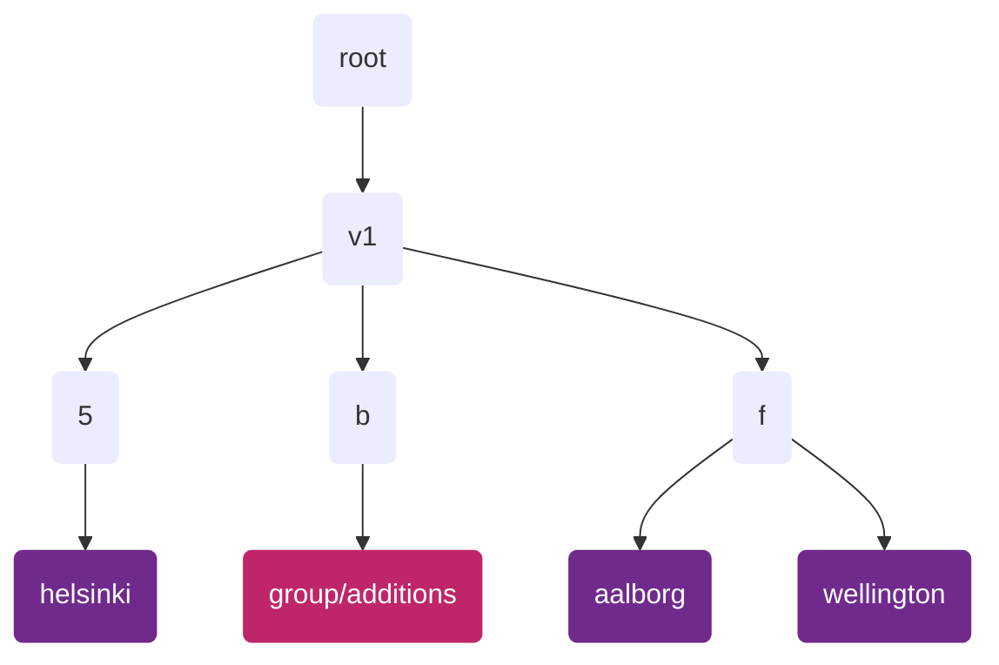
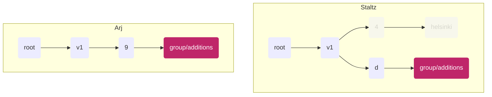
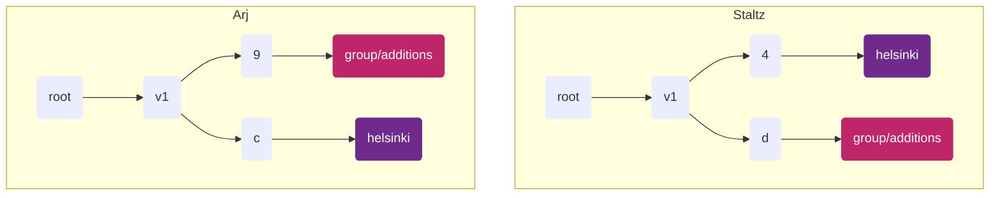

<!--
SPDX-FileCopyrightText: 2022 Mix Irving

SPDX-License-Identifier: CC-BY-4.0
-->

# ssb-meta-feeds-group-spec

Version: 1.0

Authors: Mix Irving <mix@protozoa.nz>, Andre Staltz <contact@staltz.com>

License: This work is licensed under a Creative Commons Attribution 4.0
International License.

## Abstract

This document specifies how SSB private group content is organized in a metafeed
tree, what data must be encrypted and to whom, and how peers replicate
group-related portions of the tree.

## 1. Introduction

SSB Private Groups is a symmetric encryption format that allows a large number
of peers to share a symmetric key and use it to encrypt messages to each other.
With the wide adoption of private groups, there would be a large volume of
content that is not readable by the general public, which can cause storage
problems as that content is replicated in the network.

In order to support partial replication, it is desireable to put different group
content in different subfeeds. However, we need to have a clear way to discover
how you've been invited to a group, without replicating the whole group's
content. We also need to consider how to ensure our group data is replicated
_enough_ so it's readily available for anyone who needs access to it. For
example, if a group contains only three people, and if only two people have
copies of the group data, then there's little or no gossip propagation, and the
third member can only get updates when it is directly connected one of the other
two members. Thus we need to enable _sympathetic replication_, such that peers
who don't strictly need the group content are incentivized to replicate it
anyway.

Additionally, our metafeed structure should not allow other peers to learn
which groups a peer is in, unless they are also members of the group.

Use of metafeeds for groups is described formally in Section 3 and illustrated
in the examples in Section 4.

## 2. Terminology

The key words "MUST", "MUST NOT", "REQUIRED", "SHALL", "SHALL NOT", "SHOULD",
"SHOULD NOT", "RECOMMENDED", "MAY", and "OPTIONAL" in this document are to be
interpreted as described in [RFC 2119](https://tools.ietf.org/html/rfc2119).

## 3. Functional Specification

Implementations supporting this specification MUST follow the
[ssb-meta-feeds-spec] version 1.0.

We define two types of feeds that each peer will have:

1. A `group/additions` feed
2. A "group feed" for each group

We then define three different flows for how peers can interact with these
feeds when:

1. Creating a new group
2. Adding a peer to a group
3. Discovering group membership

### 3.1. The group/additions feed

The purpose of this feed is to hold messages for coordination of joining groups.
It represents the record of all peers the user had added to groups.

- 3.1.1 Each peer running this spec MUST have an additions feed
- 3.1.2 Each peer MUST deterministically place their additions feed as a subfeed
of a shard feed, such that:
  - The shard feed is derived from the string "`group/additions`" according to
  the v1 tree structure specified in
  [ssb-meta-feeds-spec].
  - The `metafeeds/add/derived` message announcing the additions feed
    - MUST have `feedpurpose` equal to the string `group/additions`,
    - MUST be of feed format `classic`
    - MUST have `metadata` following the [ssb-meta-feeds-dm-spec] Section 1
    - MUST NOT be encrypted
- 3.1.3 If a peer A wants to add another peer B in a group, then A MUST replicate
B's additions feed and B must replicate A's additions feed
- 3.1.4 All messages published on the additions feed MUST be "`group/add-member`"
messages encrypted with [envelope-spec] encryption
  - See details below
- 3.1.5 There MUST be at most one additions feed per metafeed tree

#### `group/add-member` messages

This is the only type of message currently expected in the additions feed.
It's defined in the [private-group-spec] to look like this:

```js
{
  type: 'group/add-member',
  version: 'v2',
  root: 'ssb:message/classic/THxjTGPuXvvxnbnAV7xVuVXdhDcmoNtDDN0j3UTxcd8=',
  secret: '3YUat1ylIUVGaCjotAvof09DhyFxE8iGbF6QxLlCWWc=',
  recps: [
    'ssb:identity/group/vof09Dhy3YUat1ylIUVGaCjotAFxE8iGbF6QxLlCWWc=',    // group_id
    'ssb:feed/bendybutt-v1/YXkE3TikkY4GFMX3lzXUllRkNTbj5E-604AkaO1xbz8=', // feed_id
  ],
  tangles: {
    group: {
      // ...
    },
    members: {
      // ...
    }
  }
}
```

The important parts of this message are:

- Which group this is for (this is covered by the `root` and `secret`)
- Who it's encrypted to (the group, and the feed(s) of people being added)

The encryption of this message on the additions feed MUST follow the
[ssb-meta-feeds-dm-spec].

### 3.2. Group feeds

The purpose of this feed is to hold the messages the user publishes for a
specific group. It represents all the activity this user has in a group. The
user has at most one group feed for each group they are a member of.

Each group feed MUST be a direct subfeed of a shard feed, where the shard is
derived using the base64 encoded *group secret*.

- 3.2.1 Each peer that is a member of a group MAY have a group feed for that
group
  - It is not compulsory to have a group feed for a group the user is a member
  of, because the user may not have confirmed their participation in the group
  after being added to it.
- 3.2.2 Each peer MUST deterministically place their group feed as a subfeed of
a shard feed, such that:
  - The shard feed is derived from the base64 encoded string of the group secret
  according to the v1 tree structure specified in [ssb-meta-feeds-spec].
  - The `metafeeds/add/derived` message announcing the group feed
    - MUST have `feedpurpose` equal to the base64 encoded group secret
    - MUST be encrypted with the group secret, using [envelope-spec] encryption
- 3.2.3 Each group member SHOULD replicate the group feeds of all other group
members they know of
- 3.2.4 All content on the group feed MUST be encrypted with the group secret
key, using [envelope-spec] encryption

<details>
  <summary>Details about the shard feed</summary>
  <div>
The shard feed is derived by the base64 encoded group secret.

We cannot use the group `id`, as this is publicly known, which would give
attackers a way to test if people are in the group (breaking membership
confidentiality).

We choose the group `secret` because it is a value known only to those already
in the group.

  </div>
</details>

<details>
  <summary>Details about the group feed</summary>
  <div>

We need a `feedpurpose` which is unique to the group, which the group secret is.

We cannot use the group `id`, because this is derived using the group init
message, which does not exist until our feed exists. We encrypt this announce
message so as not to leak the `secret` and to protect membership
confidentiality.

For sympathetic replication we will therefore need a distinct type of
announcement.

  </div>
</details>

### 3.3. Creating a new group

To create a new group, a peer should perform all of the following steps
successfully:

- 3.3.1. MUST create a new symmetric group key, also known as the group secret,
which MUST have at least 32 bytes of cryptographically secure random data
- 3.3.2. MUST create a new group feed using this symmetric group key, as
described in Section 3.2
- 3.3.3. MUST publish a `group/init` message on the group feed, as described in
the [private-group-spec]
- 3.3.3. SHOULD create a group/additions feed, as described in Section 3.1,
unless there is already one for this metafeed
- 3.3.4. SHOULD publish a `group/add-member` message on the group/additions feed
to add themselves to the group, as described in Section 3.1

### 3.4. Adding a peer to a group

To add other peers to a group, a peer MUST publish a `group/add-member` message
on the group/additions feed addressed to the other peer, as described in Section
3.1. This message must be encrypted following the [ssb-meta-feeds-dm-spec].

### 3.5. Discovering group membership

To discover the members of a group, a peer MUST perform the following steps:

- 3.5.1. MUST replicate the group/additions feed of other peers, either on the
basis of friendship or because they are a known member of a group
- 3.5.2. MUST decrypt some or all `group/add-member` messages on the
group/additions feed
- 3.5.3. Each decrypted `group/add-member` message reveals, in the `recps`
field, the newly added member(s) and the group identifier, allowing the user to
infer that the newly added member(s) are members of the group

Upon a peer discovering that they are a member of a group, they MAY create a
group feed if they do not already have one. This allows them to publish messages
to the group.

## 4. Examples

The following diagram illustrates the structure of a metafeed tree for a peer,
"Staltz", who is a member of three groups: "helsinki", "aalborg", and
"wellington".



### 4.1. Creating a group

Staltz starts up his application. We assume he has already created his
`group/additions` feed (following the spec above). In his application he creates
a new "helsinki" group, which means he:

1. Creates a new symmetric `groupKey`, also known as "group secret"
2. Creates a content feed under some shard (using the `groupKey` following the
spec above)
3. Publishes a box2-encrypted `group/init` message on that new "helsinki"
content feed
4. Publishes a box2-encrypted `group/add-member` message on his
"group/additions" feed
  <details>
    <summary>details</summary>
    <div>
      This helps new members quickly see he is a member of the group, and also
      ensures he has a copy of the groupKey persisted in his records (encrypted
      to him and the group)
    </div>
  </details>


_Diagram showing Staltz feed state from his perspective_

### 4.2. Group creator invites someone

Staltz wants to invite his friend Arj to the group he set up, so he publishes a
`group/add-member` message (which contains the group `secret`) on his
"group/additions" feed.

When Arj next starts up his application and replicates Staltz's feed tree (they
are friends), he discovers the new `group/add-member` for him on Staltz's
"group/additions" feed (because peers must replicate their friends'
"group/additions" feeds).



_Diagram showing feed state of Arj and Staltz from Arj's perspective. The greyed
out feeds show feeds that exist for Staltz but which Arj has yet to want to
replicate._

Assuming he accepts this invitation, Arj then does the following:

1. Calculates the shard for the "helsinki" group for staltz, and starts
replicating that shard feed and the "helsinki" feed
2. Creates a "helsinki" feed for himself



_Diagram showing the updated state for Arj after he joins the group. Note the
shards each feed lands in are different for each person (but deterministic if
you know the `groupKey`)._

Staltz can see that Arj has accepted the invitation because he is able to
decrypt the feed announcement message for Arj's "helsinki" feed on the shard
feed, and read that the `feedpurpose` is the `groupKey`. Staltz knows which
shard feed to watch for the announcement, because Arj's shard feed is
deterministically derived with information Staltz is aware of.

### 4.3. Non-group creator invites someone

Arj now wants to invite Mix to the "helsinki" group. He follows the same pattern
as in (2), but now as the inviter.

Mix knows Arj is a part of the group because he was invited by them. Mix also
knows Staltz is part of the group because all `group/add-member` messages have

Staltz can see Arj has invited Mix because he's replicating Arj's
"group/additions" feed, so Staltz starts replicating Mix's group feed.

## 5. Security Considerations

TBD

## 6. References

### 6.1. Normative References

- [ssb-meta-feeds-spec]
- [envelope-spec]
- [private-group-spec]
- [ssb-meta-feeds-dm-spec]

### 6.2. Informative References

- [scuttlebutt-protocol-guide]
- [ssb-private-group-keys]
- [ssb-tribes2]
- [ssb-meta-feeds]

<!-- References -->

[private-group-spec]: https://github.com/ssbc/private-group-spec
[ssb-meta-feeds-spec]: https://github.com/ssbc/ssb-meta-feeds-spec
[envelope-spec]: https://github.com/ssbc/envelope-spec/
[ssb-meta-feeds-dm-spec]: https://github.com/ssbc/ssb-meta-feeds-dm-spec
[scuttlebutt-protocol-guide]: https://ssbc.github.io/scuttlebutt-protocol-guide/
[ssb-private-group-keys]: https://github.com/ssbc/ssb-private-group-keys
[ssb-tribes2]: https://github.com/ssbc/ssb-tribes2
[ssb-meta-feeds]: https://github.com/ssbc/ssb-meta-feeds
