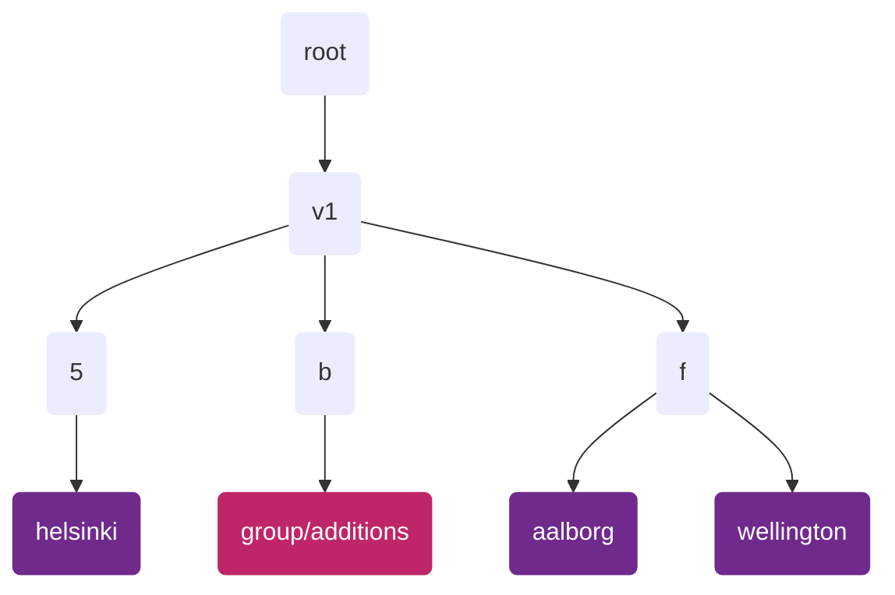
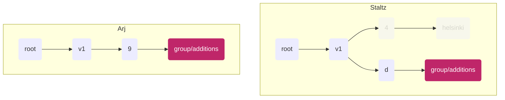
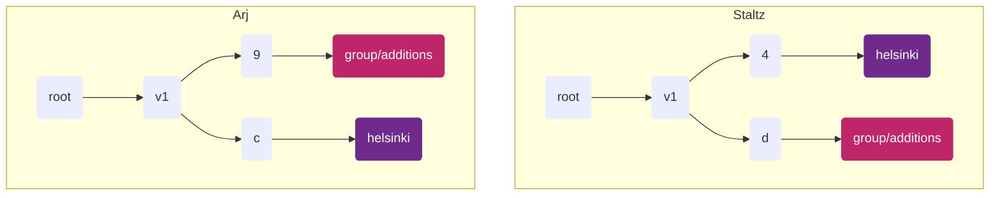

<!--
SPDX-FileCopyrightText: 2022 Mix Irving

SPDX-License-Identifier: CC-BY-4.0
-->

# ssb-meta-group-spec

Version: 1.0

Author: Mix Irving <whimful@gmail.com>

License: This work is licensed under a Creative Commons Attribution 4.0 International License.

## Abstract

In order to support partial replication, it is desireable to put different 
group content in different subfeeds. However, we need to have a clear way to 
discover how you've been invited to a group, without replicating the whole 
group's content. We also need to consider how to ensure our group data is 
replicated _enough_ so it's readily available for anyone who needs access to 
it. For example, if a group contains only three people, and if only two people
have copies of the group data, then there's little or no gossip propagation, 
and the third member can only get updates when it is directly connected one of 
the other two members. Thus we need to enable *sympathetic replication*, such 
that peers who don't strictly need the group content are incentivized to 
replicate it anyway.

This document specifies how group content is organized in a metafeed tree, what
data must be encrypted and to whom, and how peers replicate group-related 
portions of the tree.

## Terminology

The key words "MUST", "MUST NOT", "REQUIRED", "SHALL", "SHALL NOT", "SHOULD", 
"SHOULD NOT", "RECOMMENDED", "MAY", and "OPTIONAL" in this document are to be 
interpreted as described in [RFC 2119](https://tools.ietf.org/html/rfc2119).

## Principles

1. **Group membership should be opaque**
   - You shouldn't be able to guess who is in a group using public info, such as:
     - Shard feeds
     - `groupId` (as ssb-uri)
2. **Peers should replicate sympathetically**
   - If a friend has a subfeed dedicated to a group, but I don't belong to that group, it is RECOMMENDED that I replicate that subfeed
   - May be randomized or subject to sympathy-related parameters

## Specification

This work builds on the [ssb-meta-feeds-spec] (v1).

We define two types of feeds that each peer will have:
1. A `group/additions` feed
2. A "group feed" for each group

_Diagram showing an example layout of group-related feeds. Note that the shards in your
use-case will likely not be those shown, see how they are determined below._

### The additions feed

This feed holds messages which help peers join groups (e.g. `group/add-member`, `group/registration` messages).
This feed MUST be unique for each peer (a singleton).
Each peer A who replicates the root metafeed of another B SHOULD also replicate B's additions feed. 

The additions feed MUST be a direct subfeed of a shard feed, where the shard is derived using the string `group/additions` according to the 
v1 tree structure specified in [ssb-meta-feeds-spec].
The `metafeeds/add/derived` message announcing the additions feed MUST have `feedpurpose` equal to `group/additions`,
and MUST NOT be encrypted. The feed format for the additions feed MUST be `classic`.

`group/add-member` messages on the additions feed MUST follow the the [ssb-meta-feeds-dm-spec].

### Group feeds

Each group feed MUST be a direct subfeed of a shard feed, where the shard is derived using the base64 encoded 
group secret (which has 32 bytes of entropy). When the group feed is declared on the shard feed, the 
`metafeed/add/derived` message MUST have the field `feedpurpose` equal to the same base64 encoded group secret.
This message MUST be encrypted with the group secret following the [box2] method.

  
Details about the shard feed

  

The shard feed is derived by the base64 encoded group secret.

We cannot use the group `id`, as this is publicly known, which would give attackers a way to test if people are in the group (breaking Principle 1.)

We choose the the group `secret` because it is a value known only to those already in the group.
  

    

  
Details about the group feed

  

* `feedpurpose = secret` where `secret` is the base64 encoded group secret
* `feedFormat = classic`
* The `metafeed/add/derived` message on the shard feed MUST be encrypted with this group's secret

We need a `feedpurpose` which is unique to the group, which the group secret is.

We cannot use the group `id`, because this is derived using the group init message, which does not exist until our feed exists.
We encrypt this announce message so as not to leak the `secret` AND to protect group membership.

For sympathetic replication we will therefore need a distinct type of announce message (TODO)
  

## Flows

### 1. Creating a group

Staltz starts up his application.
We assume he has already created his `group/additions` feed (following the spec above).
In his application he creates a new "helsinki" group, which means he:
1. Creates a new symmetric `groupKey`, also known as "group secret"
2. Creates a content feed under some shard (using the `groupKey` following the spec above)
3. Publishes a box2-encrypted `group/init` message on that new "helsinki" content feed
4. Publishes a box2-encrypted `group/add-member` message on his "group/additions" feed
      

        
details

        

          This helps new members quickly see he is a member of the group, and also ensures he has a copy of the groupKey persisted in his records (encrypted to him and the group)
        

      

_Diagram showing Staltz feed state from his perspective_

### 2. Group creator invites someone

Staltz wants to invite his friend Arj to the group he set up, so he publishes a `group/add-member` message
(which contains the group `secret`) on his "group/additions" feed.

When Arj next starts up his application and replicates Staltz's feed tree (they are friends), he discovers
the new `group/add-member` for him on Staltz's "group/additions" feed (because peers must replicate their friends'
"group/additions" feeds).

_Diagram showing feed state of Arj and Staltz from Arj's perspective. The greyed out feeds show feeds that exist
for Staltz but which Arj has yet to want to replicate._

Assuming he accepts this invitation, Arj then does the following:
1. Calculates the shard for the "helsinki" group for staltz, and starts replicating that shard feed and the "helsinki" feed
2. Creates a "helsinki" feed for himself

 _Diagram showing the updated state for Arj after he joins the group. Note the shards each feed lands in are
 different for each person (but deterministic if you know the `groupKey`)._

Staltz can see that Arj has accepted the invitation because he is able to decrypt the feed announcement 
message for Arj's "helsinki" feed on the shard feed, and read that the `feedpurpose` is the `groupKey`.
Staltz knows which shard feed to watch for the announcement, because Arj's shard feed is deterministically
derived with information Staltz is aware of.

### 3. Non-group creator invites someone

Arj now wants to invite Mix to the "helsinki" group. He follows the same pattern as in (2), but now as the inviter.

Mix knows Arj is a part of the group because he was invited by them.
Mix also knows Staltz is part of the group because all `group/add-member` messages have

Staltz can see Arj has invited Mix because he's replicating Arj's "group/additions" feed, so Staltz starts replicating Mix's group feed.

<!-- References -->

[ssb-meta-feeds-spec]: https://github.com/ssbc/ssb-meta-feeds-spec
[box2]: https://github.com/ssbc/envelope-spec/
[pivate-group-spec]: https://github.com/ssbc/private-group-spec
[ssb-meta-feeds-dm-spec]: https://github.com/ssbc/ssb-meta-feeds-dm-spec
